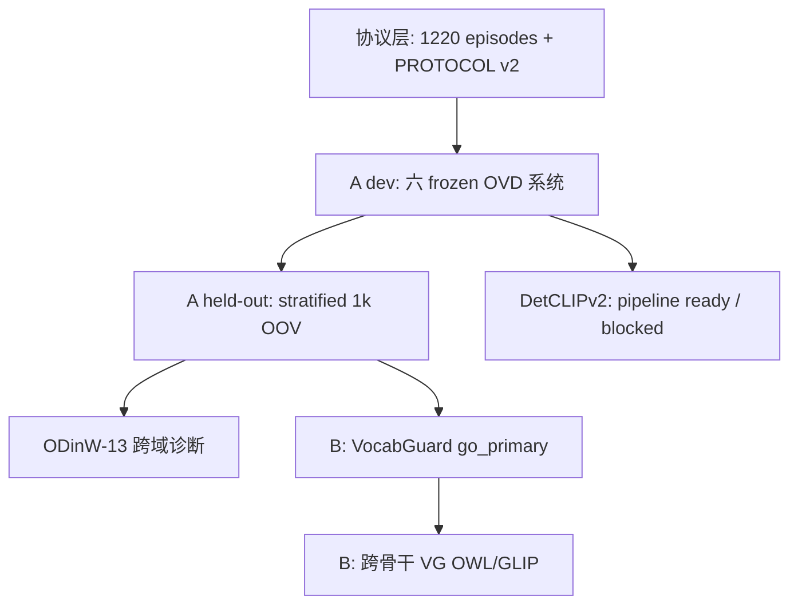

# A + B 证据链索引（师兄答辩一页表）

**更新：** 2026-07-11  
**用途：** 将「实验不够 / 找不到 report」类质疑映射到 **一句话答法 + JSON 证据 + 复现命令**。

---

## 证据链总览



---

## A 篇 — 师兄 R1–R10 速查

| 质疑 | 一句话答法 | 主证据 | 复现 |
|------|-----------|--------|------|
| R1 只是 resplit？ | 改的是 **评测合约**（固定 \(I_e,V_e\)），不是 taxonomy 重划分 | [`submission-a/paper/PROTOCOL.md`](../submission-a/paper/PROTOCOL.md)、`data/episodes/` | `bash scripts/wsl_rerun_v2.sh` |
| R2 proxy / 无 GPU？ | 主表 `gpu_used: true`，RTX 5070 WSL | `REPORT_4_main.json`、`REPORT_4b_stratified_1k.json` | 同上 |
| R5 EpiAP 与 AP 重复？ | \|V\|=1203 时 OOV≡0 但 EpiAP≪Federated AP 22.7 | `REPORT_4_main.json` \|V\|=1203 行、`fig_metric_necessity.png` | `generate_paper_tables.py` |
| R6 只有 YOLO？ | **六系统 dev** 同 episode + **五系统 stratified 1k** B0 OOV 同趋势 | `stratified_oov_six_system.tex`、`REPORT_6f` | 见下表 stratified 脚本 |
| R7 ODinW 域太少？ | **13 域** native COCO，诊断不 claim SOTA | `REPORT_5_odinw.json` | `bash scripts/wsl_odinw_full13.sh` |
| R9 stratified vs dev 矛盾？ | 两种 \(V_e\) 构造不同；held-out **主看 OOV-FP** | `REPORT_4b_stratified_1k.json` vs `REPORT_4_main.json` | `PROTOCOL.md` L53–60 |
| R10 held-out 不够？ | YOLO-S/M、OWL、GLIP-T、GDINO-base 均 **n=1000** stratified | `REPORT_4b_*` 系列 | `wsl_stratified_*.sh` |
| DetCLIP 没跑？ | **pipeline ready**；公开权重 **NOT_FOUND**（诚实 blocked） | `DETCLIP_V2_CHECKPOINT_HUNT.md`、`REPORT_6g` status | `hunt_detclip_v2_checkpoint.py` |

### A — stratified held-out 1k（B0 OOV 主信号）

| 系统 | Report | 复现命令 |
|------|--------|----------|
| YOLO-S | `REPORT_4b_stratified_1k.json` | `bash scripts/wsl_stratified_1k.sh` |
| YOLO-M | `REPORT_4b_yolo_m_stratified_1k.json` | `bash scripts/wsl_stratified_yolo_m.sh` |
| OWL-ViT | `REPORT_4b_owlvit_stratified_1k.json` | `bash scripts/wsl_stratified_owlvit.sh` |
| GLIP-T native | `REPORT_4b_native_glip_stratified_1k.json` | `bash scripts/wsl_stratified_glip_native.sh` |
| GDINO-base | `REPORT_4b_gdino_base_stratified_1k.json` | `bash scripts/wsl_gdino_base_full.sh`（stratified 段） |
| GDINO-T（补充） | `REPORT_4b_gdino_stratified_1k.json` | `bash scripts/wsl_gdino_t_stratified_1k.sh` |
| DetCLIPv2-T | `REPORT_6g` / `REPORT_4b_detclip_v2` **blocked** | 待作者权重 → `wsl_detclip_v2_full.sh` |

**汇总表：** [`submission-a/paper/tables/stratified_oov_six_system.tex`](../submission-a/paper/tables/stratified_oov_six_system.tex)

### A — dev 六系统（B0 @ \|V\|=10）

| 系统 | Report |
|------|--------|
| YOLO-S | `REPORT_4_main.json` |
| YOLO-M | `REPORT_6c_yolo_m_main.json` |
| OWL-ViT | `REPORT_6_glip_main.json` |
| GLIP-T | `REPORT_6e_native_glip_main.json` |
| GDINO-T | `REPORT_6b_glip_tiny_main.json` |
| GDINO-base | `REPORT_6f_gdino_base_main.json` |

**图：** `paper/figures/fig_metric_necessity.png`（Federated AP vs OOV 正交）

---

## B 篇 — 导师常问速查

| 质疑 | 一句话答法 | 主证据 | 复现 |
|------|-----------|--------|------|
| B1 主 claim？ | OOV ~66%→~0.5%，EpiAP **≥ B5** | `REPORT_VG_gonogo.json` `go_primary=true` | `python scripts/check_gonogo.py` |
| B2 strict go=false？ | C2 missing_class +15% **未过**；正文写 deployment-strict +2% | `REPORT_RV_gonogo.json` | 同上 |
| B4 ODinW beat B5？ | **0/13** 域 beat B5 | `REPORT_VG_odinw.json` | `run_odinw_vocabguard.py` |
| 跨骨干泛化？ | VG 在 OWL / GLIP-T 仍压 OOV | `main_cross_backbone.tex` | `bash scripts/wsl_run_owl_glip_vg.sh` |
| held-out VG？ | stratified 1k VG OOV ~0.5% vs B0 ~68% | `REPORT_VG_stratified_1k.json` | `run_stratified_vocabguard.py` |

**完整性：** `REPORT_VG_completeness.json` → `complete: true`

---

## 一键 GPU 补跑（证据链缺口）

```bash
cd /mnt/d/ccfa/submission-a
bash scripts/wsl_evidence_chain_gpu.sh
# 日志: reports/wsl_evidence_chain_gpu.log
```

顺序：YOLO-M stratified 1k → GDINO-T stratified 1k → 再生 tables/figures/PPT。

---

## 勿声称

- Beat LVIS / ODinW federated SOTA
- DetCLIPv2 真实 B0 数字（无 checkpoint）
- stratified 与 dev 的 EpisodicAP 直接横比
